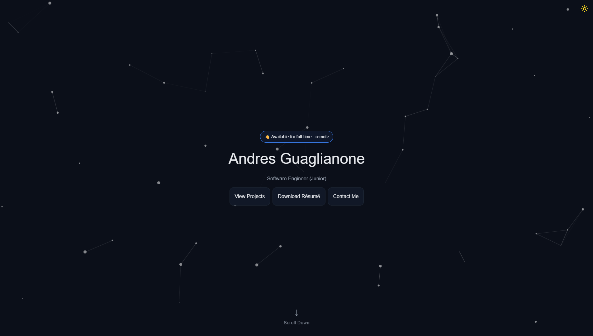

Portfolio Website

A personal portfolio built with React, Tailwind CSS and JavaScript, showcasing my projects, skills, and experience as a software engineer.

🚀 Features

Responsive design (works across devices)

Smooth navigation with reusable components

Sections for About, Projects, Skills, Languages, Contact

Clean and modern UI

🛠️ Tech Stack

React

JavaScript (ES6+)

Tailwind CSS

Git & GitHub

📂 Structure

my-portfolio/
├── public/          # Static assets (logos, particles config, icons)  
├── src/  
│   ├── assets/      # Images and media  
│   ├── components/  # Reusable UI components (Navbar, Cards, ThemeToggle, etc.)  
│   ├── sections/    # Page sections (Hero, About, Projects, Contact, etc.)  
│   ├── data/        # Experience, projects, skills, languages  
│   ├── App.jsx      # Root component  
│   ├── main.jsx     # Entry point  
│   └── index.css    # Global styles  
├── index.html       # HTML entry point  
├── package.json     # Project metadata + dependencies  
└── vite.config.js   # Vite configuration  

📸 Preview

📧 Contact

Email: andresfgpicon@gmail.com

LinkedIn: [Andres Guaglianone](https://www.linkedin.com/in/andres-guaglianone-935742267/)

GitHub: [andresfelipe0715](https://github.com/andresfelipe0715)